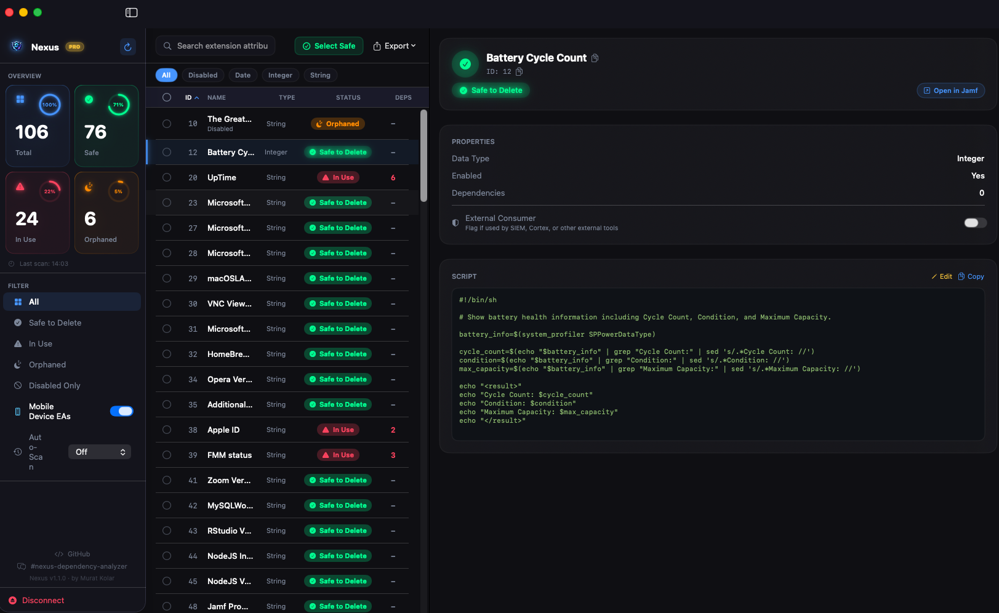
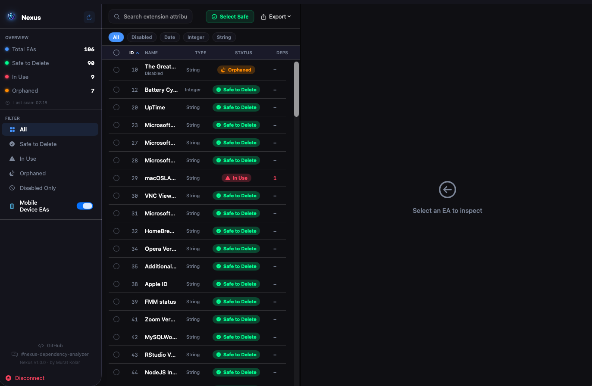
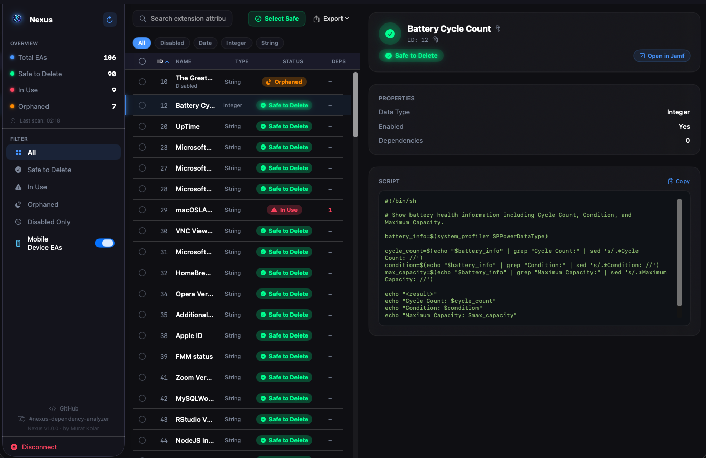
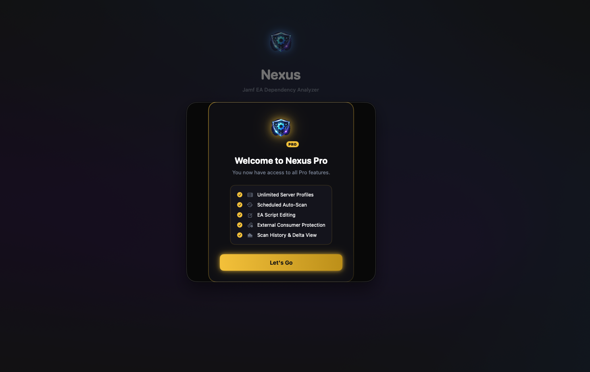
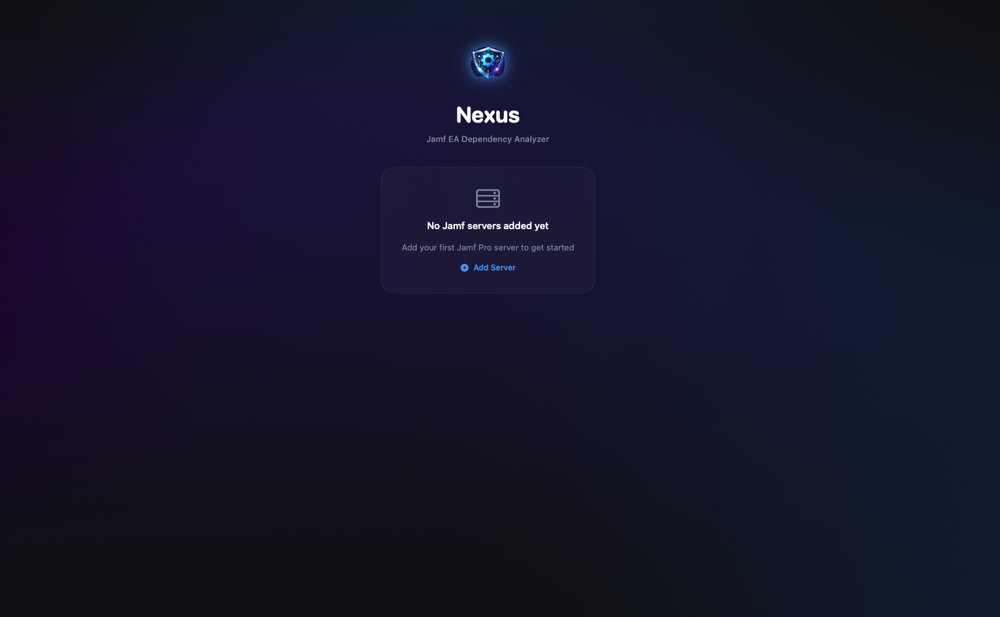
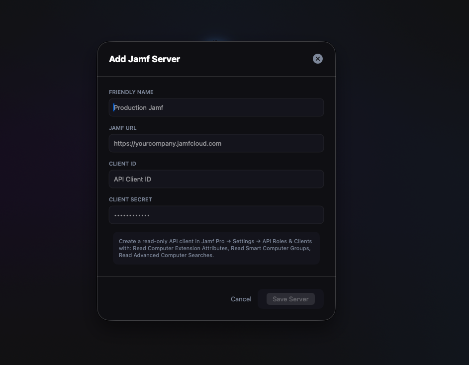
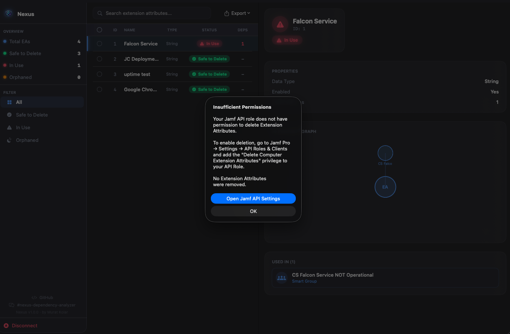

<div align="center">


# Nexus
### Jamf EA Dependency Analyzer

**Know exactly what's safe to delete — before you delete it.**

[](https://github.com/MUMO97/nexus/releases)
[](https://swift.org)
[](https://github.com/MUMO97/nexus/releases)
[](LICENSE)
[](https://macadmins.slack.com)

</div>

---

Jamf Pro environments accumulate Extension Attributes over time. Deleting the wrong one silently breaks Smart Groups, Policies, and Config Profiles. **Nexus maps every dependency across your entire environment in one scan** — so you know with certainty what is referenced, what is orphaned, and what is genuinely safe to remove.

<div align="center">



</div>

---

## Table of Contents

- [Features](#features)
- [Free vs Pro](#free-vs-pro)
- [Installation](#installation)
- [Getting Started](#getting-started)
- [Setting Up Jamf API Credentials](#setting-up-jamf-api-credentials)
- [Understanding Results](#understanding-results)
- [How to Use Safely](#how-to-use-safely)
- [Troubleshooting](#troubleshooting)
- [Privacy & Security](#privacy--security)
- [Support](#support)

---

## Features

### Dependency Scanning
- Connects to Jamf Pro via **OAuth2 API credentials** — no username/password required
- Scans all **Computer and Mobile Device** Extension Attributes in a single authenticated pass
- Maps dependencies across **9 object types** simultaneously:
  - Smart Groups (Computer & Mobile)
  - Advanced Searches + Display Columns (Computer & Mobile)
  - Policies
  - Configuration Profiles (macOS & Mobile)
  - Restricted Software
  - Patch Policies
  - Mobile Configuration Profiles
- XPath parsing on Classic API XML — immune to Jamf's known single-item JSON serialisation bug
- If one object type fails (insufficient permissions), Nexus returns partial results with a warning rather than failing the entire scan

### Status Classification

| Status | Meaning |
|--------|---------|
| 🟢 **Safe to Delete** | Not referenced by any Jamf object — safe to remove |
| 🔴 **In Use** | Actively referenced — deleting **will break** configurations |
| 🟠 **Orphaned** | Referenced by objects that no longer exist — review before deleting |

### Interactive Dependency Graph
Visual node graph showing exactly which objects reference each EA — colour-coded by object type for instant identification.

<div align="center">



</div>

### Script Preview & Editing
- View EA script bodies inline without opening Jamf Pro
- Copy script to clipboard in one click
- **Pro:** Edit scripts directly in Nexus and push changes back to Jamf

<div align="center">



</div>

### Filters, Search & Sorting
- Filter by: Status · Scope (Computer/Mobile) · Data type · Disabled only
- Full-text search across all EA names
- Sort by ID, Name, Status, or Dependency count — ascending/descending

### Bulk Operations
- **Select Safe** — auto-selects all safe-to-delete EAs with one click
- Bulk delete with two-step confirmation
- Nexus warns loudly if any selected EA is In Use
- Export report before deleting for audit trail

### Export
- **CSV** — flat spreadsheet for Excel/Google Sheets
- **JSON** — structured export for scripting
- **HTML Report** — formatted cleanup report for Confluence or stakeholder review

---

## Free vs Pro

<div align="center">

| Feature | Free | Pro |
|---------|:----:|:---:|
| Dependency scanning | ✅ | ✅ |
| Status classification (Safe/In Use/Orphaned) | ✅ | ✅ |
| Interactive dependency graph | ✅ | ✅ |
| Script preview | ✅ | ✅ |
| Filters, search & sorting | ✅ | ✅ |
| Bulk delete with confirmation | ✅ | ✅ |
| CSV / JSON / HTML export | ✅ | ✅ |
| **Server profiles** | 1 | ∞ |
| **Scheduled auto-scan** | ❌ | ✅ |
| **EA script editing** | ❌ | ✅ |
| **External consumer protection** | ❌ | ✅ |
| **Scan history & delta view** | ❌ | ✅ |

**[Get Nexus Pro — $4.99/month →](https://celeast.gumroad.com/l/nexus)**

</div>

### Pro Feature Details

**Unlimited Server Profiles**
Connect to and instantly switch between multiple Jamf Pro instances — Production, Staging, UAT. All credentials stored securely in Keychain per profile.

**Scheduled Auto-Scan**
Set Nexus to automatically rescan your environment every hour, day, or week. Catch new dependencies added by your team without manual intervention.

**EA Script Editing**
View and edit EA scripts directly inside Nexus. Make changes and push them back to Jamf Pro without leaving the app or opening a browser.

**External Consumer Protection**
EAs consumed by external integrations (CrowdStrike Falcon, Splunk, Microsoft Sentinel, Cortex XDR, Tenable, Okta, asset management tools) show **zero internal Jamf dependencies** and appear Safe to Delete — but deleting them silently breaks those integrations. Mark them as externally protected so they can never be accidentally deleted, regardless of dependency count.

**Scan History & Delta View**
Every scan is saved. See exactly what changed between scans — which EAs were added, removed, or changed status. Essential for change management in regulated environments.

<div align="center">



</div>

---

## Installation

### Download
1. Go to [**Releases**](https://github.com/MUMO97/nexus/releases)
2. Download the latest `Nexus-v1.1.0.zip`
3. Unzip and drag `Nexus.app` to `/Applications`

> **Note:** v1.1.0 is Developer ID signed. Notarization is currently in progress with Apple. Until complete, macOS Gatekeeper will show a warning on first launch.
> **To bypass:** Right-click `Nexus.app` → **Open** → **Open**. You only need to do this once.

---

## Getting Started

### Step 1 — First Launch

<div align="center">

</div>

On first launch you'll see the welcome screen. Click **Add Server** to configure your first Jamf Pro connection.

### Step 2 — Add Your Jamf Server

<div align="center">

</div>

Enter:
- **Friendly Name** — anything you like, e.g. `Production` or `Staging`
- **Jamf URL** — your full Jamf Pro URL including port if needed, e.g. `https://company.jamfcloud.com` or `https://jamf.company.com:8443`
- **Client ID** — from your Jamf Pro API Role & Client
- **Client Secret** — from your Jamf Pro API Role & Client

Click **Save Server**, then **Connect**.

### Step 3 — Review the Scan

Nexus will authenticate, scan all EAs, and build the dependency map. The sidebar shows your environment at a glance:
- **Total EAs** — everything found
- **Safe to Delete** — confirmed zero dependencies
- **In Use** — has live references
- **Orphaned** — referenced by deleted objects

Click any EA in the list to see its full dependency breakdown in the right panel.

### Step 4 — Clean Up Safely

1. Use the **Status filter** in the sidebar to show only **Safe to Delete** EAs
2. Click **Select Safe** in the toolbar to auto-select all of them
3. Click **Export** first — create a CSV/HTML report as an audit trail
4. Click **Delete** — review the confirmation dialog
5. Confirm — Nexus will delete each EA via API and show a delete log

---

## Setting Up Jamf API Credentials

In Jamf Pro, go to **Settings → System → API Roles and Clients**.

### Minimum permissions for read-only scanning

| Permission | Required for |
|-----------|-------------|
| Read Computer Extension Attributes | EA list |
| Read Mobile Device Extension Attributes | Mobile EA list |
| Read Smart Computer Groups | Smart Group dependencies |
| Read Smart Mobile Device Groups | Mobile Smart Group dependencies |
| Read Advanced Computer Searches | Advanced Search dependencies |
| Read Advanced Mobile Device Searches | Mobile Advanced Search dependencies |
| Read Policies | Policy dependencies |
| Read macOS Configuration Profiles | Config Profile dependencies |
| Read Mobile Device Configuration Profiles | Mobile Config Profile dependencies |
| Read Restricted Software | Restricted Software dependencies |
| Read Patch Management Software Titles | Patch Policy dependencies |

### Additional permission for deletion

| Permission | Required for |
|-----------|-------------|
| Delete Computer Extension Attributes | Deleting Computer EAs |
| Delete Mobile Device Extension Attributes | Deleting Mobile EAs |

> **Tip:** Create a dedicated API Role named `Nexus Read` and a separate `Nexus Admin` role with delete permissions. Use the read-only role day-to-day and switch to admin only when performing cleanup.

---

## Understanding Results

### What "Safe to Delete" actually means

An EA classified as **Safe to Delete** has zero references in any of the 9 scanned object types at the time of the scan. This means:

- No Smart Group uses it as a criterion
- No Advanced Search filters on it
- No Policy is scoped to a group that depends on it
- No Config Profile targets it

**It does not mean** the EA has no value — it may be collecting data used by an external system (SIEM, vulnerability management platform, asset management tool) that reads directly from Jamf's API. See **External Consumer Protection** in Pro features.

### What "Orphaned" means

The EA is referenced by a Jamf object that no longer exists — a deleted Smart Group or Advanced Search that still has a stale reference in the EA's configuration. These are safe to delete in most cases but worth a quick review to confirm the referencing object was intentionally deleted.

### Dependency count

The number next to each EA shows how many distinct Jamf objects reference it. An EA with 12 dependencies across 3 Smart Groups and 9 Config Profiles should be treated with care even if you're only trying to change a script — use the graph view to understand the full blast radius.

---

## How to Use Safely

**Before any bulk delete:**

1. **Export first.** Always export a CSV or HTML report before deleting. Paste it into Confluence or attach it to your change ticket. Jamf does not have an EA recycle bin.
2. **Check orphaned EAs.** Don't auto-delete orphaned EAs without reviewing them. The referenced object may have been deleted by mistake.
3. **Scan fresh before deleting.** If you haven't scanned in more than a day, click Refresh before bulk selecting. Dependencies change as your team works.
4. **Staged cleanup.** In large environments, delete in batches of 10–20 rather than all at once. Verify Jamf is behaving normally between batches.
5. **Check external consumers.** If your environment uses SIEM tools (Splunk, Microsoft Sentinel), EDR platforms (CrowdStrike Falcon, Cortex XDR), or vulnerability management tools (Tenable, Rapid7), flag EAs that feed those systems using **External Consumer Protection** (Pro) before running cleanup.

---

## Troubleshooting

### "Hostname not found" / Cannot connect

- Verify the Jamf URL is correct and includes the port if needed (`https://jamf.company.com:8443`)
- Confirm your Mac can reach the Jamf server from its current network — try opening the URL in Safari first
- If your Jamf instance uses a self-signed certificate or internal CA, Nexus handles TLS validation bypass automatically for hostname mismatches

### "Insufficient Permissions" error

<div align="center">

</div>

Your API role is missing one or more required permissions. Nexus will tell you which scan failed.

- Go to **Jamf Pro → Settings → API Roles and Clients**
- Edit your API Role and add the missing permission (see [table above](#setting-up-jamf-api-credentials))
- Click **Refresh** in Nexus — no need to reconnect

> **Important:** Jamf's Classic API returns `401` for permission errors, not `403`. Nexus handles both correctly.

### Scan completes but shows fewer EAs than expected

- Check if **Mobile Device EAs** are toggled on in the sidebar (disabled by default)
- Verify your API role has permission to read both Computer and Mobile Device Extension Attributes
- If the scan shows a yellow warning banner, one object type failed to scan — check the warning message for which one

### EA shows "Safe to Delete" but I know it's used

This happens when:
1. **The EA feeds an external system** — SIEM, EDR, vulnerability platform, or asset management tool pulling data via the Jamf API. These integrations have no footprint inside Jamf's object model. Use **External Consumer Protection** (Pro) to flag them.
2. **A Jamf object was recently added** that uses the EA — click **Refresh** to rescan
3. **The dependency is in an object type not yet scanned** — PreStage Enrollment scoping is not yet supported (on the roadmap)

### "The operation couldn't be completed" on delete

- Your API role needs Delete permission for Extension Attributes (separate from Read)
- Check if the EA is locked or managed by a Jamf patch management title — those cannot be deleted via API
- Verify your OAuth2 token hasn't expired — click **Refresh** to get a new token

### App blocked by Gatekeeper on first launch

Notarization for v1.1.0 is currently in progress with Apple. Until it completes:

```
Right-click Nexus.app → Open → Open
```

You only need to do this once. Future releases will be fully notarized.

### License key not accepted

- Ensure you're using the key from your **Gumroad confirmation email** — not the order number
- Keys are unique per purchase — one key per subscription
- If you lost your key, log into [gumroad.com/library](https://app.gumroad.com/library) to retrieve it
- Check your internet connection — activation requires a live API call to verify the key

---

## Privacy & Security

- **No telemetry.** Nexus collects zero usage data, analytics, or crash reports.
- **No cloud.** All communication is directly between your Mac and your Jamf Pro server. Nothing passes through any third-party service.
- **Keychain storage.** All credentials (Client Secret, license key) are stored exclusively in the macOS Keychain — never in plain text or UserDefaults.
- **Read-first design.** Nexus only writes to Jamf when you explicitly click Delete. Everything else is read-only.
- **Open source.** The full source code is available in this repository. Audit it yourself.

---

## Support

- **Mac Admins Slack:** [#nexus-dependency-analyzer]([https://macadmins.slack.com/archives/C0AHJR1U1M2)
- **Bug reports & feature requests:** [GitHub Issues](https://github.com/MUMO97/nexus/issues)
- **Get Nexus Pro:** [celeast.gumroad.com/l/nexus](https://celeast.gumroad.com/l/nexus)

---

## License

Nexus is open source under the [GNU General Public License v3.0](LICENSE).

You are free to view, fork, and contribute. Derivative works distributed publicly must also be open source under the same license.

Copyright © 2025 Murat Kolar.

---

<div align="center">

Built by **Murat Kolar** — macOS/Jamf administrator.

If Nexus has saved you time, consider starring the repo ⭐ or sharing it in your admin community.

</div>
